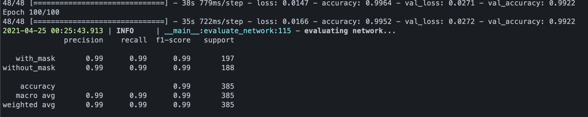

# 1. BEEES Make-a-thon 2021

This repository stores the project created for the [University of Bristol BEEES Make-a-thon 2021][1].

- [1. BEEES Make-a-thon 2021](#1-beees-make-a-thon-2021)
  - [1.1. About the Hackathon](#11-about-the-hackathon)
  - [1.2. Our Team](#12-our-team)
  - [1.3. Our Project](#13-our-project)
  - [1.4. Tech Stack](#14-tech-stack)
    - [1.4.1. Machine Learning](#141-machine-learning)
  - [1.5. Deployment](#15-deployment)
    - [1.5.1. Requirements](#151-requirements)
      - [1.5.1.1. Teensy (Optional)](#1511-teensy-optional)
      - [1.5.1.2. ML Model](#1512-ml-model)
      - [1.5.1.3. Python](#1513-python)
    - [1.5.2. Deploy](#152-deploy)
  - [1.6. Usage](#16-usage)
    - [1.6.1. application.py](#161-applicationpy)
    - [1.6.2. train_mask_detector.py](#162-train_mask_detectorpy)

---
## 1.1. About the Hackathon

The BEEES Make-a-thon is a 48-hour hackathon that is open to all courses and years of students in the University of Bristol. 

The theme for 2021 is **COVID-19**.

---

## 1.2. Our Team

Our team (named Rogue One after the fact that we were team 1 and Star Wars is awesome) consists of 6 people from the University of Bristol, all of whom are from Hong Kong:

- [Mitch Lui][2] (Computer Science, 1st year)
- [Otis Lee][3] (Electrial and Electronic Engineering, 1st year)
- [Javis Lo][4] (Aerospace Engineering, 1st year)
- [Ken Young][5] (Aerospace Engineering, 1st year)
- [Dominic Chu][6] (Finance, 1st year)

---

## 1.3. Our Project

We decided to create a mask detection application to ensure that people are wearing masks correctly when entering stores or indoor places where social distancing is not possible.

A Machine Learning model based on this [article][7] was adapted and improved upon by introducing a larger dataset, which allowed us to reach a high degree of accuracy when trying to detect if people were wearing masks correctly.

The model is then connected to a webcam to get a live feed and detect if a person is wearing a mask. If they are wearing a mask, a connected Arduino board will let the person know they can enter by disabling the LED which is always on when the people in front of the webcam are not wearing masks correctly.

---

## 1.4. Tech Stack

The tech stack of our project involves the following components:

- Machine Learning Model (built on Tensorflow, Keras)
- Teensy for LED (Optional)
- Mask Detection programme (OpenCV)


### 1.4.1. Machine Learning

Specifically, we created an image classifier that, based on webcam input, analyses the frame in real time and determines if the user was wearing a mask.

The following shows the theoretical performance of the model after 100 epochs based on our dataset (~2000 images):



The model has an astonishingly high accuracy rate of 99%. Of course this is purely theoretical but as we can see that in practice the model works quite well:


From the above gif we can see that when Mitch is not wearing a mask (or not wearing it properly / trying to cheat the system) the LED on the Teensy is turned on to tell me that I am not wearing the mask properly.

---

## 1.5. Deployment

### 1.5.1. Requirements

#### 1.5.1.1. Teensy (Optional)

[Teensy][8] is a microcontroller based on the Arduino Software. The model for Teensy used in this project is Teensy 3.6. Specific versions of Arduino that supports the Teensyduino library are 1.0.6, 1.6.5, 1.6.9, 1.6.11, 1.6.12, 1.6.13, 1.8.13. The LED used in this project is the in-built LED of the Teensy board (pin 13). Below are the steps to setting up softwares and physical connections for teensy 3.6:

1. Install [Arduino software][9] 
2. Install [teensyduino 1.5.3][10]
3. (optional for windows) Install [teensy loader][11]
4. Connect teensy board using data cable
5. Run the Arduino Software, load `examples/firmata/StandardFirmata` and upload to teensy board
6. Let the teensy board reload (LED should blink a few times)
7. Install pyfirmata (as included in `requirements.txt`)

#### 1.5.1.2. ML Model

By default, a model is already given with this repository. If you would like to train your own model, you will need to do the following:

1. Gather your dataset - 1 set of images of people wearing masks, and 1 set of images of people not wearing masks (or not wearing them correctly).
2. Put them into separate folders - `with_mask` and `without_mask`, then put these two folders into a folder called `dataset` (or anything you prefer, but remember the name of what you called the folder)
3. Run `train_mask_detector.py` (To see how to run it, go to [this section](#162-train_mask_detectorpy))

#### 1.5.1.3. Python

A `requirements.txt` file is included, to install Python dependencies:

```sh
pip3 install -r requirements.txt
```

### 1.5.2. Deploy

See usage instructions for [application.py](#161-applicationpy)

---

## 1.6. Usage

### 1.6.1. application.py

This is the main application.

To run:

```sh
python3 application.py <arguments>
```

Arguments:

| Flag | Full Argument name    | Optional (Y/N)           | Type       | Default Value                | Description                                                           |
| ---- | --------------------- | ------------------------ | ---------- | ---------------------------- | --------------------------------------------------------------------- |
| `-f` | `--face`              | Y                        | string     | `"face_detector"`            | Path to face detector model directory                                 |
| `-m` | `--model`             | Y                        | string     | `"mask_detector.model"`      | Face mask detector model name                                         |
| `-r` | `--retrain`           | Y                        | store_true | `True` when used             | Retrain machine learning model                                        |
| `-d` | `--dataset`           | Y (N when -r is not used)| string     | `"dataset"`                  | Path to input dataset                                                 |
| `-c` | `--confidence`        | Y                        | float      | `0.8`                        | Minimum confidence level for mask model                               |
| `-s` | `--source`            | Y                        | integer    | `0`                          | Webcam source (0 for built-in, 1 or more for external cams if any)    |  
| `-p` | `--port`              | Y                        | string     | `"/dev/tty.usbmodem85635301"`| Port for Teensy                                                       |
| `-h` | `--help`              | Y                        | flag       | N/A                          | Help                                                                  |


### 1.6.2. train_mask_detector.py

Used to train the mask detector model:

```sh
python3 train_mask_detector.py <arguments>
```

Arguments:

| Flag | Full Argument name    | Optional (Y/N)           | Type       | Default Value                | Description                                                           |
| ---- | --------------------- | ------------------------ | ---------- | ---------------------------- | --------------------------------------------------------------------- |
| `-d` | `--dataset`           | N                        | string     | `"dataset"`                  | Path to input dataset                                                 |
| `-m` | `--model`             | Y                        | string     | `"mask_detector.model"`      | Face mask detector model name                                         |
| `-e` | `--epochs`            | Y                        | integer    | `20`                         | Epochs (Number of passes)                                             |
| `-h` | `--help`              | Y                        | flag       | N/A                          | Help                                                                  |

---

[1]: https://www.beees.co.uk/make-a-thon-2021-announcement/
[2]: https://www.linkedin.com/in/mitchlui/
[3]: https://www.linkedin.com/in/otis-lee-9154a91ba/
[4]: https://www.linkedin.com/in/yat-chung-javis-lo-807611200/
[5]: https://www.linkedin.com/in/ken-y-6b6379142/
[6]: https://www.linkedin.com/in/dominic-chu-544966178/
[7]: https://www.pyimagesearch.com/2020/05/04/covid-19-face-mask-detector-with-opencv-keras-tensorflow-and-deep-learning/
[8]: https://www.pjrc.com/teensy/
[9]: https://www.arduino.cc/en/software
[10]: https://www.pjrc.com/teensy/td_download.html
[11]: https://www.pjrc.com/teensy/loader.html